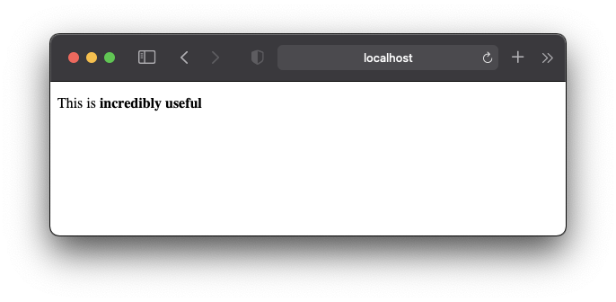

# Rails I18n Compass

This repository contains lots of examples for Rails' `i18n`.

## Best practices

* [ ] Avoid translations "top" level, like `I18n.t("foo")`
* [ ] When splitting into multiple files, use that namespace only. For example `thing.(locale).yml` should only contain `I18n.t("thing.*")`.

## Pluralization

Any translation can be pluralized by providing `count` as an additional argument

```ruby
I18n.t('shared.friend', count: 0)   # => "No friends"
I18n.t('shared.friend', count: 1)   # => "1 friend"
I18n.t('shared.friend', count: 42)  # => "42 friends"
```

There are `3` pluralization levels: `zero`, `one` and `other`.

```yaml
en:
  shared:
    friend:
      zero: "No friends"
      one: "1 friend"
      other: "%{count} friends"
```

In some cases and languages we can omit the `zero` value:

```yaml
en:
  shared:
    friend:
      one: "1 friend"
      other: "%{count} friends"
```

### `String#pluralize` and `String#singularize`

Note that Rails also provides [`String#pluralize`](https://api.rubyonrails.org/classes/String.html#method-i-pluralize) and [`String#singularize`](https://api.rubyonrails.org/classes/String.html#method-i-singularize), but this **does NOT use I18n** and basically only works for `:en` "out-of-the-box".

```ruby
"friend".pluralize(0)  # => "friends"
"friend".pluralize(1)  # => "friend"
"friend".pluralize(2)  # => "friends"
"friends".singularize  # => "friend"
```

## HTML entities in translations

If translations contain HTML entities, they are automatically escaped:

```yaml
en:
  home:
    show:
      sentence: "This is <b>really useful</b>"
```

```erb
<p><%= t('.sentence') %></p>
```


In order to make the words bold we have two options

* Use `raw` to not escape HTML entities
* Use `_html` suffix in the translation key

### Use `raw` to not escape HTML entities

Put `raw` in front of the translation method

```erb
<p><%= raw t('.sentence') %></p>
```

### Use `_html` suffix in the translation key

Name the translation key `sentence_html`. Rails automatically skips escaping HTML entities if they end with `_html`:

```yaml
en:
  home:
    show:
      sentence_html: "This is <b>incredibly useful</b>"
```

```erb
<p><%= t('.sentence_html') %></p>
```



## ActiveRecord

### Errors

Translations for error messages on an ActiveRecord model can be achieved like this:

```ruby
class User < ApplicationRecord
  validates :name, presence: true
end
```

Rails will then look up these places in the locale file, and use the first translation that exists (from top to down).

1. `activerecord.errors.models.[model_name].attributes.[attribute_name].[key]`
2. `activerecord.errors.models.[model_name].[key]`
3. `activerecord.errors.messages.[key]`
4. `errors.attributes.[attribute_name].[key]`
5. `errors.messages.[key]`

...where...

* `model_name` = `user`
* `attribute_name` = `name`
* `key` = `blank`

That means that we _could_ place the translations in these locations:

```yaml
en:
  activerecord:
    errors:
      messages:
        blank: 'should really not be blank (3)'
      models:
        user:
          attributes:
            name:
              blank: 'should really not be blank (1)'
          blank:
            'should really not be blank (2)'
  errors:
    attributes:
      name:
        blank: 'should really not be blank (4)'
    messages:
      blank: 'should really not be blank (5)'
```

In most cases you want to use location `1` only.

This will be the generated error message:

```ruby
u = User.new(name: '')
u.validate

u.errors.full_messages
# => ["Ninja Nickname should really not be blank (1)"]
```

Depending on the validation (`presence`) a specific translation key is used (`blank`).
The complete mapping for these messages can be found in the [Rails I18n documentation](https://guides.rubyonrails.org/i18n.html#error-message-interpolation).

### Helpers

Any class that inherits from `ApplicationRecord` automatically has certain methods that are connected to translations

#### `.model_name.human(count)`

```yaml
en:
  activerecord:
    models:
      user:
        one: "Ninja"
        other: "Ninjas"
```

```ruby
User.model_name.human     # => "Ninja"
User.model_name.human(2)  # => "Ninjas"
```

#### `.human_attribute_name(attribute)`

```yaml
en:
  activerecord:
    attributes:
      user:
        name: "Ninja Nickname"
```

```ruby
User.human_attribute_name(:name) # => "Ninja Nickname"
```

#### `.human_enum_name(enum_name, enum_value)` (inofficial)

This class method **does not come with Rails** (yet 😬), but it's super helpful and very easy to include in a project.

You can either install/include [`human_enum_name` gem](https://github.com/jkostolansky/human_enum_name) or you can put this method into `ApplicationRecord` (`./app/models/application_record.rb`):

```ruby
class ApplicationRecord < ActiveRecord::Base
  #...
  def self.human_enum_name(enum_name, enum_value)
    I18n.t("activerecord.attributes.#{model_name.i18n_key}.#{enum_name.to_s.pluralize}.#{enum_value}")
  end
end
```

(Credits to [Juraj Kostolanský](https://github.com/jkostolansky))

##### Example

Let's assume an enum:

```ruby
class User < ApplicationRecord
  enum favourite_language: [:ruby, :crystal]
end
```

```yaml
en:
  activerecord:
    attributes:
      user:
        favourite_languages:   # Note plural
          crystal: "I love Crystal"
          ruby: "Ruby forever"
```

```ruby
User.human_enum_name(:favourite_language, :crystal)   # => "I love Crystal"
User.human_enum_name(:favourite_language, :ruby)      # => "Ruby forever"
```

Using an object:

```ruby
user = User.new(favourite_language: :ruby)
User.human_enum_name(:favourite_language, user.favourite_language) # => "Ruby forever"
```

### Form objects

If you're into form objects, then you can use translations on them too.

In this example we use a simplified form class:

```ruby
class Admin::UploadAttachmentForm
  include ActiveModel::Model

  delegate :persisted?, :to_param, to: :@object

  validates :notes, presence: true
  validate :validate_file_size

  def initialize(object, params = {})
    @object = object
    @params = params
  end

  def notes
    @params[:notes]
  end

  def file_size
    42
  end

  def validate_file_size
    if true
      errors.add(:file_size, :too_big)
    end
  end

  def model_name
    ActiveModel::Name.new(self, nil, 'Admin::UploadAttachmentForm')
  end
end
```

Now we can define the translations in the `en.activemodel.*` namespace for `attributes`, `errors` and `models`:


```yaml
en:
  activemodel:
    attributes:
      admin/upload_attachment_form:
        notes: "Attachment notes"
        file_size: "File size:"

    errors:
      models:
        admin/upload_attachment_form:
          attributes:
            notes:
              blank: "should not be blank"
            file_size:
              too_big: "Way too big!"

    models:
      admin/upload_attachment_form: "Upload attachment for admins"
```

#### Translate model

```ruby
Admin::UploadAttachmentForm.model_name.human
# => "Upload attachment for admins"
```

#### Translate attributes

```ruby
Admin::UploadAttachmentForm.human_attribute_name(:notes)
#  => "Attachment notes"
```

#### Translate errors

```ruby
form = Admin::UploadAttachmentForm.new(nil, { notes: '' })
form.validate

form.errors.full_messages
# => ["Attachment notes should not be blank", "File size: Way too big!"]
```
